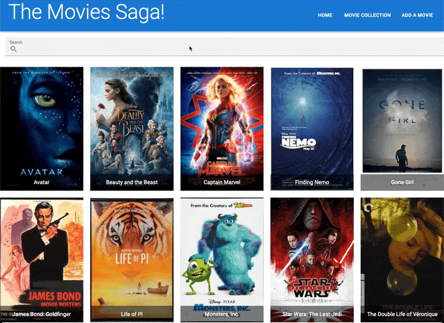
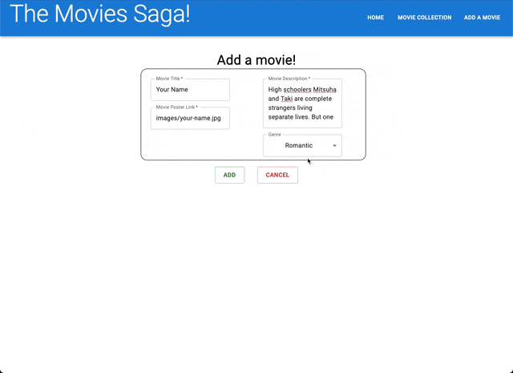
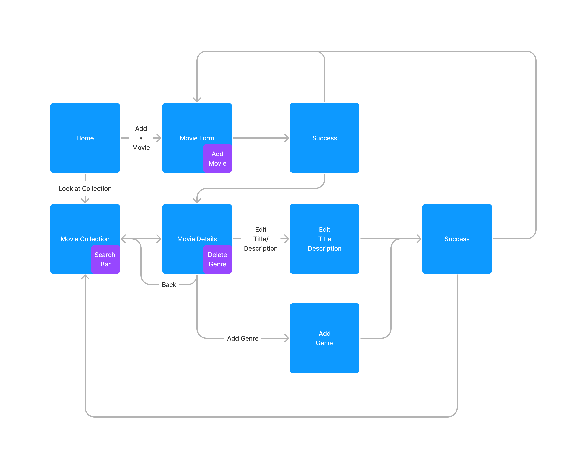

# Redux Feedback Form:

## Description

_Duration: 12 hour Sprint_

Over the course of a weekend, the goal was to create a functional full-stack web based application. The web based application allow users to create a movie collection.

## Screen Shots
GIF showing movie collection feature:

GIF showing movie form feature:

## Description & Approach

In order to better understand where each path should lead to, I created a flow chart of how each path is interconnected. This allowed me to keep organized as I was aware of what each component should be doing.

### Prerequisites
- [Node.js](https://nodejs.org/en/)
- [React.js](https://react.dev/)
- [Redux.js](https://redux.js.org)
- [Redux-Saga.js](https://redux-saga.js.org/)
- [Express.js](https://expressjs.com/)
- Body-Parser
- 'PG'
- Database Manager

## Installation
1. Clone this repository for your own access.
2. Open up your editor of choice and run `npm install`
3. Using your preferred database manager. Use the provided SQL file to set up the database as well as insert dummy data if needed.
4. Run `npm run server`  and `npm run client` in two different terminals.
5. Navigate to http://localhost3000/

## Usage
This web application is meant to create an interactive feedback form where users can submit their feedback, or go back to any previous pages:
 1. The user can look at all the movies in their collection by navigating to movie collections.
 2. On the movie collection page, users can use the search bar to narrow down to a specific movie if needed.
 3. By clicking on the movie poster, users can see more details about the movie such as a description and the genres.
 4. Users can choose to edit the title or description, or they can choose to add or delete genres if they feel if the genres do not match the movie.
 5. By navigating to the add a movie page, users can fill out a form to add another movie to the collection.

## Acknowledgement
Thanks to [Prime Digital Academy](www.primeacademy.io) who equipped and helped me to make this application a reality.

## Support
If you have suggestions or issues, please email me at [paulhoanglong@gmail.com](www.google.com)